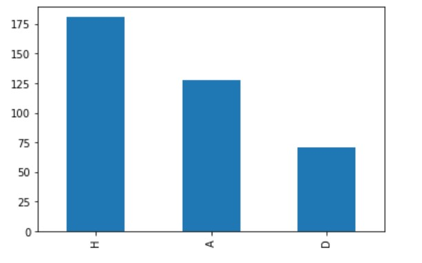
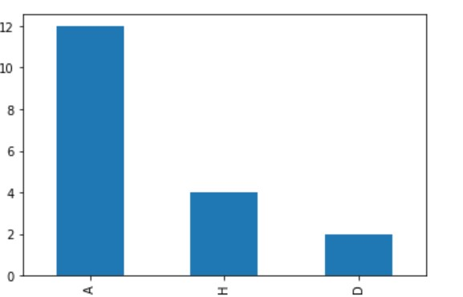

    The GitHub History of the premier league games 📚📈 

  👀 England premier league :
 

Le championnat d'Angleterre de football est la plus importante compétition de football en Angleterre Lancée en 1888 par la Football Association sous le nom de « Football League », la compétition laisse place en 1992 à la Premier League, transformée en Barclays Premier League de 2004 à 2016 avant de reprendre son appellation précédente..

<!-- TABLE OF CONTENTS -->

  
PLAN DE TRAVAIL

  <ol>
    <li>
      
    </li>
     <li>
      <a href="#about-the-project"> Préparation et nettoyage des données</a>
    </li>
     <li>
      <a href="#getting-started">Fusionner les DataFrames</a>
      <ul> </ul>
    </li>
    <li>
      <a href="#getting-started">Le projet est-il encore activement maintenu</a>
    </li>
    <li>
      <a href="#getting-started">Y a-t-il de la camaraderie dans le projet ?</a>
    </li>
     <li>
      <a href="#getting-started">Quels sont les fichiers qui ont été modifiés dans les dix dernières pull requests ?</a>
    </li>
    <li>
      <a href="#getting-started">Qui a fait le plus de pull requests sur un fichier donné ?</a>
    </li>
     <li>
      <a href="#getting-started"> Qui a fait le plus de pull requests sur un fichier donné ?</a>
    </li>
     <li>
      <a href="#getting-started">  Les pull requests de deux développeurs particuliers</a>
    </li>
     <li>
      <a href="#getting-started"> Visualiser les contributions de chaque développeur</a>
    </li>
    

<!-- ABOUT THE PROJECT -->
  A propos du projet:

ce projet contient tous les information concernant les matches de premier league(2018-2019) . Dans ce projet, vous devrez lire, nettoyer et visualiser le référentiel des matches de premier league(2018-2019)

   

 Prérequis:

 
  
* python

  
 * Jupyter Notebook

 Features:

<li>Div:	Division the game was played in</li>
<li>Date:	The date the game was played</li>
<li>omeTeam:	The home team</li>
<li>AwayTeam:	The away team</li>
<li>FTHG:	Full time home goals</li>
<li>FTAG:	Full time away goals</li>
<li>FTR:	Full time result</li>
<li>HTHG:	Half time home goals</li>
<li>HTAG:	Half time away goals</li>
<li>HTR:	Half time result</li>
<li>Referee:	The referee of the game</li>
<li>HS:	:Number of shots taken by home team</li>
<li>AS:	Number of shots taken by away team</li>
<li>HST:	Number of shots taken by home team on target</li>
<li>AST:	Number of shots taken by away team on target</li>
<li>HF:	Number of fouls made by home team</li>
<li>AF:	Number of fouls made by away team</li>
<li>HC:	Number of corners taken by home team</li>
<li>AC:	Number of corners taken by away team</li>
<li>HY:	Number of yellow cards received by home team</li>
<li>AY:	Number of yellow cards received by away team</li>
<li>HR:	Number of red cards received by home team</li>
<li>AR:	Number of red cards received by away team</li>
  
 Loading libraries :

<li> import pandas as pd</li>
<li> import matplotlib </li>
<li> import seaborn </li>

👩‍🏫 Préparation des données:

notre projet composé une seul fichier : <mark>epl.csv :</mark> contient les informations de matches de premier league(2018-2019)  

  
  

📊  Visualisation de données:

  
*full time result: l'analyse montre que les plupart de matches sont gagner par l'équipe à domicile

  
    

 

* apres l'analyser nous avons constate que l'équipe qui a une carton rouge va de perdre le match que ce soit à domicile où bien à l'exterieur ,cette figure montre la plupart des resultas quand l'equipe à domicile recoit une carton rouge:   
   

  

 
CONCLUSION: j'ai conclure que les cartons rouge ont un effet sur les resultats de les matches ainsi que le terrain des matches

